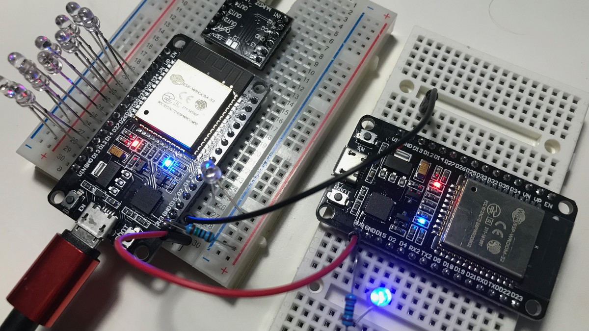

# ESP32 projects

The ESP32 are well suited for our data collection project at AISVN with many analog pins, deep sleep modes to work long on battery power and WiFi capabilities to transfer data to the internet. This is accompanied by sufficient fast processing power and large memory. Some projects that use the ESP32 are:

- [solarmeter](https://github.com/kreier/solarmeter) Measures the created electric energy on our renewable energy station at AISVN including photovoltaic cells, wind generator, battery voltages and temperature 2020/06/23
- [T200](https://github.com/kreier/T200) robot car controlled by Bluetooth BLE 2019/04/08
- [Webserver in MicroPython](https://github.com/kreier/python2018/tree/master/micropython/webserver) with button control 2019/12/16


This repository collects smaller [sniplets](sniplets) and projects that don't require its own repository. Some of these are:

- [Blink2020](sniplets/Blink2020) only short flashing, HIGH/LOW easier to alter
- [Blink2020sweep](sniplets/Blink2020sweep) find the pin the LED is attached to (different with every board ...)
- [ESP32 power consumption](ESP32_power_consumtion) test script to place the ESP32 in different power modes to measure the energy consumption
- [I2C scanner](sniplets/i2c_scan) scans the i2c bus for devices
- [i2cdetect](sniplets/i2cdetect) replicates the output of the Raspberry Pi output. Here with rtc and flash on ZS-042:

```
i2cdetect
Scanning address range 0x00-0x7F
 
     0  1  2  3  4  5  6  7  8  9  a  b  c  d  e  f
00: -- -- -- -- -- -- -- -- -- -- -- -- -- -- -- --  
10: -- -- -- -- -- -- -- -- -- -- -- -- -- -- -- --  
20: -- -- -- -- -- -- -- -- -- -- -- -- -- -- -- --  
30: -- -- -- -- -- -- -- -- -- -- -- -- -- -- -- --  
40: -- -- -- -- -- -- -- -- -- -- -- -- -- -- -- --  
50: -- -- -- -- -- -- -- 57 -- -- -- -- -- -- -- --  
60: -- -- -- -- -- -- -- -- 68 -- -- -- -- -- -- --  
70: -- -- -- -- -- -- -- -- -- -- -- -- -- -- -- --  

```

- [startup-post](startup-post) See a message at [https://sites.google.com/view/startup-post](https://sites.google.com/view/startup-post) after a succesfull boot and internet connection of your IoT project.

## History

This repository started in March 2019. I was new to the ESP8266 and ESP32 and took the first steps with both, documentation on GitHub and using BLE. The [T200](https://github.com/kreier/T200) was a successful robot car project from this time, controlled by Bluetooth BLE.

I wrote back then:

> 2019/03/24

We had several Arduino Uno projects at our school. But soon you want to add some bluetooth or WiFi functionality to your project. You need another module, library, cable and so on. Why not use the ESP32 that has all that out of the box? And much more RAM and storage for data and all kinds of projects? That's why it's here. Let's start simple.

### [Visit the Wiki](https://github.com/kreier/ESP32/wiki)!



## Blink
Unlike the Arduino the build-in LED is not connected to pin 13, but pin 2. Everything else is the same. Once it blinks you know that the module works, you can upload stuff and you have a simple output signal for further experiments. If you use the board "**DOIT ESP32 DEVKIT V1**" you can use the "**File > Examples > 01.Basics > Blink** out of the box.

## BLE with iPhone remote
Bluetooth Low Energy BLE is a little more complicated than Bluetooth 2.0. The ESP can do both, and the serial connection with an ESP32 is pretty straight forward. Comparable with a HC-05.

BLE is a little more complicated, because there are services, characteristics, descriptors, properties, values and several of them with their own UUID. Using nRF Connect, BLE Scanner and LightBlue it was easy to connect to the ESP with the build-in examples. But I wanted to use the remote app GoBLE. More in the [Wiki](https://github.com/kreier/ESP32/wiki).
